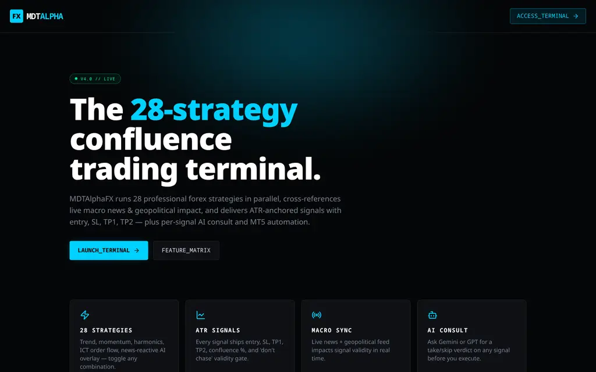
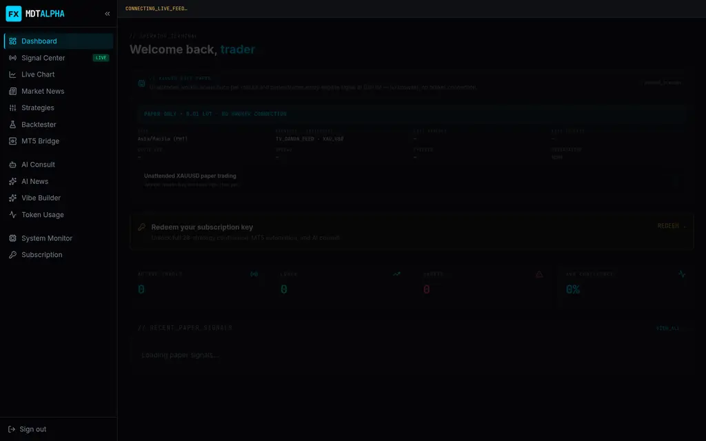
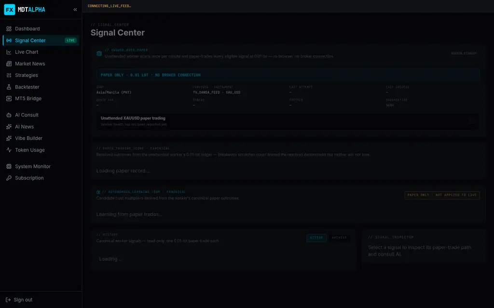
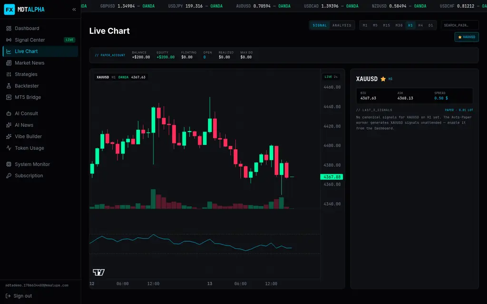
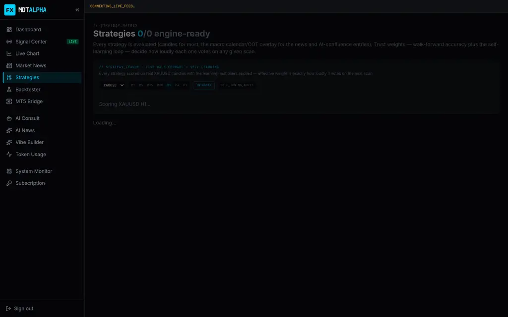
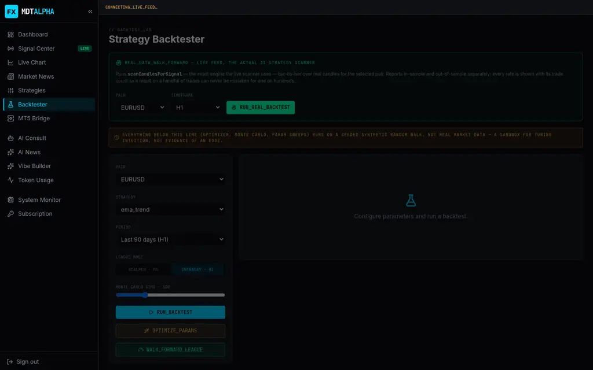
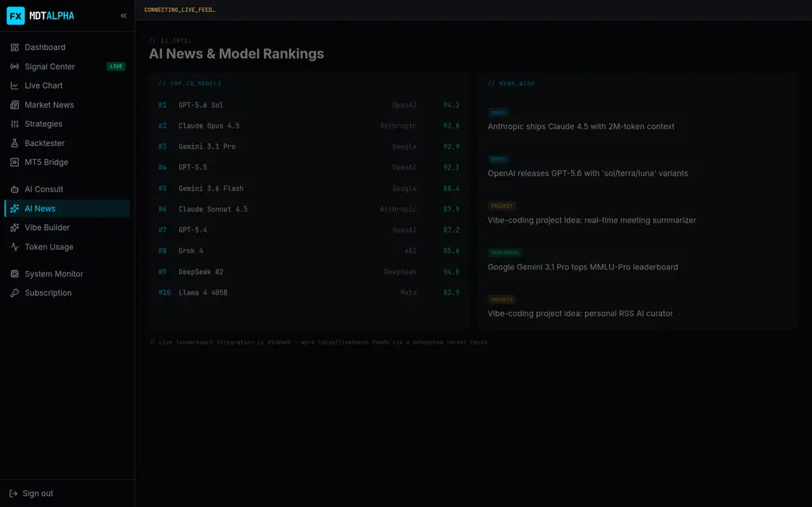
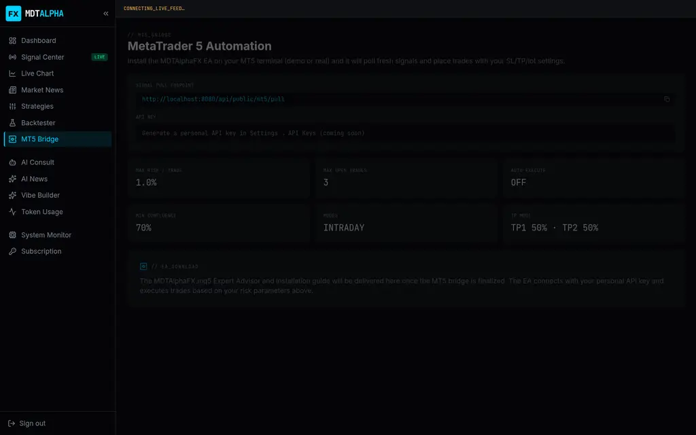
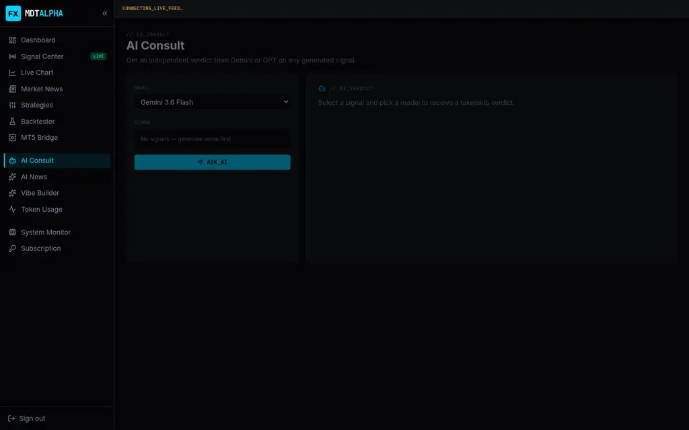
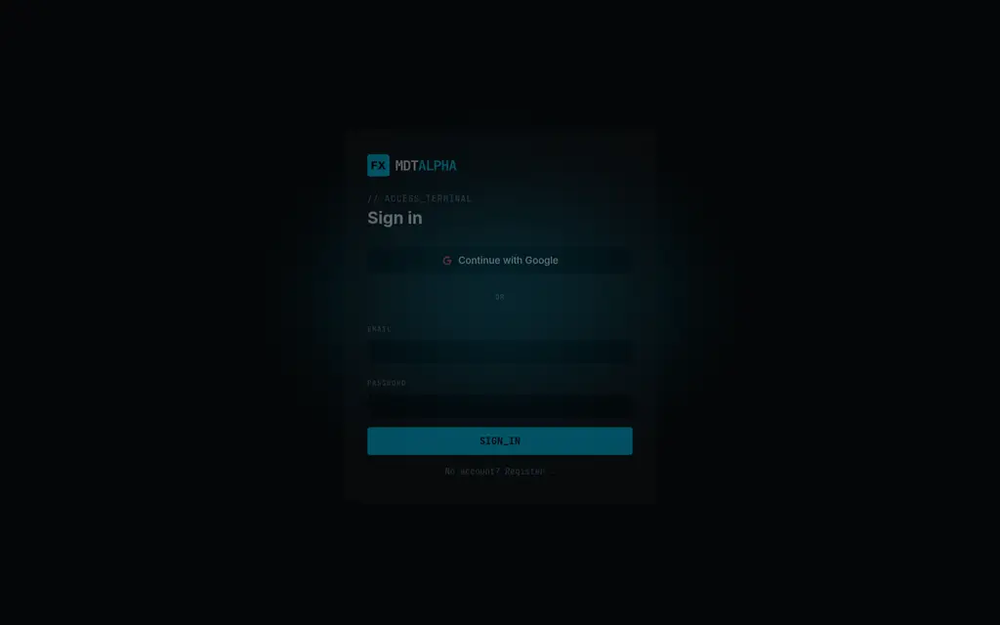

# MDTAlphaFX — 36-Strategy Forex Confluence Terminal

A cyberpunk-styled trading intelligence platform. MDTAlphaFX runs **36 professional
forex strategies in parallel**, cross-references live macro news, COT positioning and
geopolitical events, and emits **ATR-anchored signals** (entry · SL · TP1 · TP2) with a
per-signal AI consult layer, an unattended **auto-paper trading worker**, a real-data
walk-forward backtester, and an MT5 bridge surface.

> **Status: early development — the core signal + auto-paper pipeline is LIVE and trading
> paper on real market data.** Everything below is verified as of 2026-08-13.



---

## Verified state — 2026-08-13

| Gate | Result |
| --- | --- |
| Unit tests (`bun test src/lib/`) | **394 pass / 0 fail** |
| Database tests (`bun tools/pgtap-run.mjs`) | **105 assertions pass** (PGlite + pgTAP harness, no Postgres needed) |
| Typecheck (`tsc --noEmit`) | **clean** |
| Production build (`vite build` + nitro) | **green** |
| Auto-paper worker | **LIVE** on Supabase `mggqzhcacqthwoygmrhg` — keyless feed, minute cron, real paper signals in the ledger |
| Market feed | **TV keyless feed** (TradingView OANDA XAUUSD bid/ask + Yahoo candles) — no broker account or API key required |

## Screenshots

| | | |
| --- | --- | --- |
|  |  |  |
|  |  |  |
|  |  |  |

## What works today

**Signal engine (`src/lib/`)** — the calibration programme is the core asset:

- **36 implemented strategies** across momentum, trend, volatility, orderflow,
  mean-reversion, breakout, harmonic and macro categories — including five
  reversal/exhaustion detectors (`rsi_divergence`, `macd_divergence`,
  `climax_exhaustion`, `stop_run_reversal`, `failed_breakout`).
- **Confluence clustering, not vote counting** — `strategy-clusters.ts` discounts
  duplicated reads (six agreeing MAs: 95 → 74; four independent reads stay 84).
- **Regime detection** (`regime.ts`) — Wilder ADX(14), ATR percentile, Kaufman
  efficiency ratio → `strong_trend / weak_trend / range / expansion / contraction`,
  weights 0.65–1.25, never zero.
- **Location layer** (`location.ts`) — premium/discount within the swing, adverse
  distance from EMA21, headroom to structure. The direct fix for buying tops; sets a
  `chasing` flag instead of vetoing.
- **Mode arbiter** (`mode-arbiter.ts`) — scalp / intraday / wait / stand_down with the
  evidence stated in a sentence.
- **Armed setups** (`armed-setup.ts`) — forming-but-not-triggered setups with trigger,
  invalidation and expiry.
- **Calibration** (`calibration.ts`) — isotonic (PAVA) reliability curve, refuses to
  report below 20 samples per bin.
- **B-single execution semantics** — TP1 arms a breakeven stop (a 0.01 lot can't be
  halved), the whole position runs to TP2. `hit_tp1` is a scratch (0R), not a win.
- **Side-aware fills** — longs enter at ask / exit at bid; stops and targets are tested
  against the correct side. A real fixture swings 2.25R between old and new rules.
- **Honest macro layer** — news events matched in `(-30, +60]` minutes around the real
  release with a proximity-scaled *penalty* (0 at 60 min → −8 at release, no positive
  branch), COT decays on a 5-day half-life and abstains past 14 days.
- **Replay analytics** (`replay-analytics.ts`) — MAE/MFE/bars-held diagnostics per
  trade. Descriptive, deliberately not an optimiser.

**Auto-paper worker — LIVE** (`supabase/functions/xauusd-paper-worker`):

- Scans **once per minute** on the keyless TV feed, paper-trades every eligible signal
  at **0.01 lot** — no browser, no broker connection, no API key.
- Full paper trade state machine (B-single), canonical schema, atomic worker RPCs,
  30-day soft archive, health reports every minute with a degradation drill path.
- MT5-style open-position block in Signal Center: live price, floating P&L in $,
  breakeven/exit markers, paper terminal bar.
- Deployment runbook: `tools/deploy-xauusd-paper.sh` (dry-run by default) +
  `tools/verify.sh`.

**Live chart & quotes** — real-time XAUUSD chart with strategy overlays; live FX quotes
from the keyless feed (verified rendering EURUSD/GBPUSD/USDJPY/XAUUSD etc. on 2026-08-13).

**Signal autopsy** (chart → ANALYSIS) — for any canonical signal, the trade's full story:
event ledger (entry fill → TP1/BE arming → exit), peak MFE / trough MAE in R, bars held,
ambiguity flags, and — for open trades — live hold-to-TP1 meters (distance in R and $,
progress, and the ledger's own "will it hold?" odds: what fraction of resolved trades at
this proximity actually reached TP1). Resolved trades get a **policy what-if table**:
close-at-TP1, trail 1.0×ATR after TP1, and early-BE-at-+0.5R are re-simulated on the chart
candles against the live B-single control, so an exit-policy change is promoted only when
the ledger says it wins. Analysis only — the worker keeps `b_single_v1`.

**Backtester** — `REAL_DATA_WALK_FORWARD` on the live feed with the actual 36-strategy
scanner, side-aware resolution, Level Diagnostics (clears 30+ resolved trades → whether
TP1 at 1.25R is misplaced on real gold).

**App shell** — 14 authenticated surfaces: Dashboard, Signal Center, Live Chart, Market
News, Strategies, Backtester, MT5 Bridge, AI Consult, AI News, Vibe Builder, Token
Usage, System Monitor, Subscription, plus the landing and sign-in pages.

## What's stubbed, parked, or pending

| Area | State |
| --- | --- |
| **Dukascopy history** (`tools/fetch-history.mjs`) | **BLOCKED on network egress.** Four workstreams wait on it: measured cost model (spreads are provisional), W3.1 re-derived strategy clusters (current map is a prior), W4 parameter calibration (walk-forward + permutation), W7 event-reaction profiles. |
| **MT5 execution** | **Parked.** The paper worker replaced it as the learning input. The MT5 Bridge page documents the EA ↔ signal-pull contract; the EA itself is not built. |
| **AI Consult** | UI + server functions (`consultOnSignal`) exist with a Gemini/GPT model picker; verdicts need the provider keys wired server-side. |
| **AI News & model rankings** | **Hardcoded fixtures** — the page self-labels "live leaderboard integration is stubbed; wire lmsys/livebench feeds via a scheduled server route". |
| **Vibe Builder** | Template spec scaffold; needs the AI gateway wired to generate dynamically. |
| **Token / credit usage graphs** | Page exists; usage tracking needs the consult gateway live. |
| **Subscription / redeem** | Server functions + UI implemented; key issuance is operator-side. |
| **Strategy trust weights** | The UI shows walk-forward accuracy as a target metric; weights today are priors until history lands. |
| **Historical signal rows** | Scored under the old (all-out, mid-price) policy — re-scoring is correct in principle, out of scope so far. |

## Stack

React 19 · TanStack Start (SSR) · Vite 8 · Tailwind CSS v4 (cyberpunk theme) ·
lightweight-charts · Supabase (Postgres + Auth + Edge Functions + cron via pg_net) ·
TypeScript strict · **Bun** (the repo is bun-managed — `bun.lock`; **never run `npm install`**).

## Development

```sh
git clone https://github.com/mrmtsuruya/MDTAlphaFX.git
cd MDTAlphaFX
bun install
bun run dev          # http://localhost:8080
```

Verification (one shot): `bash tools/verify.sh` — sandbox-copies the tree, symlinks
`node_modules`, then runs tests + typecheck + build. Individual gates:

```sh
bun test src/lib/            # 394 unit tests
bun tools/pgtap-run.mjs      # 105 pgTAP assertions (WASM Postgres, no server needed)
bunx tsc --noEmit            # typecheck
bun run build                # production build
```

Environment: copy `.env.example` → `.env.local`. The app needs Supabase URL +
publishable key; the auto-paper worker additionally needs `XAUUSD_WORKER_CRON_SECRET`
(see `docs/strategy-audit.md` and `HANDOFF.md` for the full activation sequence).

## Repository layout

| Path | What |
| --- | --- |
| `src/lib/` | Signal engine, calibration, paper state machine, providers (OANDA + TV keyless), server functions |
| `src/routes/` | All app surfaces (TanStack Router) |
| `src/components/` | App shell, chart, auto-paper panel, paper position |
| `supabase/migrations/` | Schema, RLS, worker RPCs, cron — verified by pgTAP |
| `supabase/functions/xauusd-paper-worker/` | The live minute worker (Edge function) |
| `supabase/tests/database/` | pgTAP suites (7 files, 105 assertions) |
| `tools/` | fetch-history, deploy runbook, pgTAP harness, verify.sh, AI-CLI bridge |
| `docs/` | Strategy audit, handoffs, screenshots |

## Roadmap (short → long)

1. **Unblock Dukascopy history** → measured cost model, re-derived clusters, W4
   calibration, W7 event reactions. This is the highest-leverage item.
2. **Real MT5 EA** for live broker execution (demo first).
3. **Wire AI Consult** with per-model token/credit accounting → makes Token Usage real.
4. **Live AI news feeds** (LMSYS/LiveBench) and a dynamic Vibe Builder.
5. Pairs beyond XAUUSD (gold-first by design; 13 more planned).

## Legal

Trading signals are not financial advice. Paper trading is simulated; past or
paper-tested performance does not guarantee future results.
